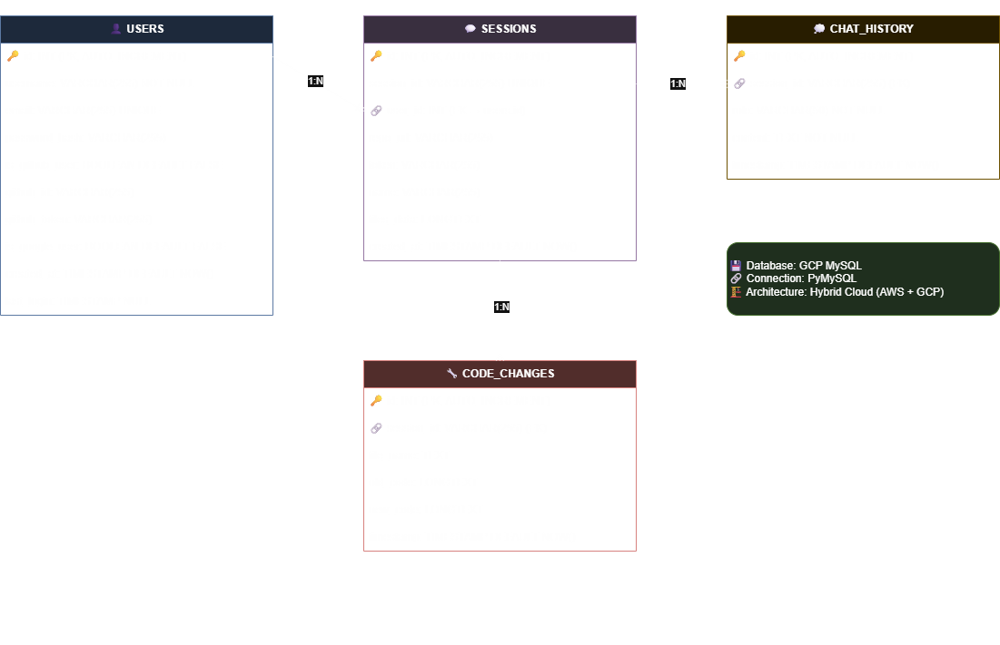

# 🖥️ GitHub 기반 코드 분석 챗봇


> **SK Networks Family AI 캠프 4차 프로젝트**  
> 최신 AI 기술을 활용한 혁신적인 코드 분석 챗봇 시스템

## 📋 프로젝트 개요


### 👨‍👩‍👧‍👦 팀 소개 | 떡잎마을 방범대
<table>
  <tr> 
    <td align="center">
      
    </td>
    <td align="center">
      
    </td>
    <td align="center">
      
    </td>
    <td align="center">
      
    </td>
    <td align="center">
      
    </td>
  </tr>
  <tr>
    <td align="center"><sub><b>김이경</b></sub></td>
    <td align="center"><sub><b>노명구</b></sub></td>
    <td align="center"><sub><b>지상원</b></sub></td>
    <td align="center"><sub><b>허한결</b></sub></td>
    <td align="center"><sub><b>황차해</b></sub></td>
  </tr>
</table>

## 🎯 프로젝트 목적 및 배경

### 🚫 현재 AI 도구들의 한계점

현재 ChatGPT와 같은 AI 도구들은 GitHub 저장소에 대한 구체적인 정보 제공에 한계가 있습니다:

1. **구조 파악 한계**: GitHub 저장소의 구조를 정확히 알지 못함
2. **기능 위치 불명**: 특정 기능이 어떤 파일에 있는지 부정확한 정보 제공
3. **번거로운 코드 분석**: 코드 파악을 위해 각 파일을 개별적으로 다운로드하여 입력해야 함

### ✨ 우리의 솔루션

**GitHub 저장소 URL만 입력하면 해당 저장소에 대한 질문에 답변하고 코드 수정까지 가능한 AI 챗봇**을 개발하였습니다.

## 🏗️ 시스템 아키텍처


### 핵심 구성 요소


## ⚙️ 주요 기능

### 💬 채팅 시스템
- **사용자 질의**: GitHub 저장소에 대한 자연어 질문
- **AI 응답**: 분석결과 기반 정확한 답변 생성
- **대화 기억**: 이전 대화 내용 기억 및 맥락 유지
- **채팅 이력 관리**: 세션별 대화 이력 저장/조회

### 📊 저장소 분석
- **GitHub 연동**: GitHub API를 통한 저장소 정보 수집
- **코드 파싱**: 코드 파일을 청크 단위로 분할 및 분석
- **임베딩 생성**: 코드 청크를 벡터로 변환하여 ChromaDB에 저장
- **메타데이터 추출**: 파일명, 함수명, 클래스명, 복잡도 등 생성
- **브랜치 관리**: 다양한 브랜치의 코드 분석 지원
- **파일 트리 뷰**: 저장소의 디렉토리 구조 시각화

### 🔧 코드 수정
- **수정 제안**: AI가 코드 개선 사항 제안
- **변경 미리보기**: 코드 변경 사항을 적용 전에 미리보기 제공
- **Git 연동**: 변경사항을 Git 커밋 및 GitHub 푸시
- **변경 이력**: 코드 변경 내역 추적 및 관리

### 🔐 사용자 인증
- **회원가입**: 이메일 기반 일반 회원가입
- **로그인**: 이메일/패스워드 기반 로그인
- **GitHub OAuth**: GitHub 계정으로 로그인
- **Google OAuth**: Google 계정으로 로그인
- **세션 관리**: 로그인 상태 유지 및 자동 로그아웃

### ⚙️ 세션 관리
- **세션 생성**: 저장소별 채팅 세션 생성
- **세션 관리**: 세션명 변경, 순서 조정, 삭제
- **세션 내보내기**: 채팅 내용을 마크다운으로 내보내기
- **컨텍스트 정리**: 메모리 사용량 최적화를 위한 컨텍스트 정리

## ⚙️ 기술 스택 및 의존성

###  백엔드 기술 스택

| 분류 | 기술/라이브러리 | 버전 | 용도 |
|------|----------------|------|------|
| **웹 프레임워크** | Flask | 3.1.1 | 웹 서버 및 API 엔드포인트 |
| **AI/ML** | OpenAI | 1.82.1 | GPT API 호출 |
| **벡터 데이터베이스** | ChromaDB | 1.0.11 | 임베딩 저장 및 검색 |
| **HTTP 클라이언트** | Requests | 2.32.3 | GitHub API 호출 |
| **Git 라이브러리** | GitPython | 3.1.44 | Git 저장소 조작 |
| **AI 프레임워크** | LangChain | 0.3.25 | 문서 처리 및 체인 구성 |
| **UI 프레임워크** | Bootstrap-Flask | 2.5.0 | UI 컴포넌트 |
| **환경 설정** | python-dotenv | 1.1.0 | 환경 변수 관리 |
| **암호화** | cryptography | 45.0.3 | 토큰 암호화 |
| **데이터베이스** | PyMySQL | latest | MySQL 연결 |
| **비밀번호 해싱** | bcrypt | latest | 비밀번호 암호화 |
| **토큰화** | tiktoken | 0.9.0 | 텍스트 토큰 계산 |
| **마크다운 처리** | markdown | 3.6 | 마크다운 파싱 |

###  프론트엔드 기술 스택

| 분류 | 기술/라이브러리 | 버전 | 용도 |
|------|----------------|------|------|
| **CSS 프레임워크** | Tailwind CSS | 2.2.19 | 스타일링 |
| **아이콘** | Material Icons | latest | 아이콘 표시 |
| **코드 하이라이팅** | Highlight.js | 11.9.0 | 코드 문법 강조 |
| **JavaScript** | Vanilla JS | ES6+ | 클라이언트 로직 |

###  인프라 및 배포

| 분류 | 기술/서비스 | 용도 |
|------|-------------|------|
| **클라우드 플랫폼** | AWS | 웹 애플리케이션 호스팅 |
| **데이터베이스** | GCP MySQL | 관계형 데이터 저장 |
| **컨테이너** | Docker | 애플리케이션 컨테이너화 |
| **웹 서버** | Gunicorn | WSGI 서버 |

## 🔄 동작 과정

### 1단계: GitHub 저장소 분석
1. Flask 웹 서버가 GitHub 저장소 URL 요청 받음
2. GitPython 라이브러리를 이용해 GitHub 저장소를 로컬로 복제
3. `.py`, `.js`, `.md` 같은 분석 대상 파일만 선택
4. 코드 파일을 작게 청크(chunk)로 나눔
5. Python은 함수/클래스 단위로, Markdown은 제목 단위로 분할
6. 청크마다 파일명, 함수명, 클래스명, 시작/끝 줄, 역할 태그 등 메타데이터 생성
7. 각 청크에 대해 임베딩(숫자 벡터로 변환)하고 ChromaDB에 저장

### 2단계: 사용자 질문 처리
1. Flask 라우트가 질문을 받아 `handle_chat()` 함수 실행
2. 질문 내용을 LLM에게 보내서 질문 의도(역할) 파악
3. 질문도 임베딩해서 관련된 청크 검색
4. 1차: 역할 태그 기반 청크 검색
5. 2차: 해당 파일 전체 로드
6. 과거 대화 내용도 함께 분석해 맥락 유지

### 3단계: 답변 생성
1. LLM에게 보낼 프롬프트 구성:
   - 질문 내용
   - 관련 코드 청크들
   - 코드의 메타데이터 (파일명, 함수명, 줄 수, 역할 태그 등)
   - 디렉토리 구조
   - 이전 대화 기록
2. 시스템 프롬프트로 역할 지정: "당신은 GitHub 코드 분석 전문가입니다"
3. LLM이 질문에 대해 근거 있는 응답을 생성해서 사용자에게 반환

### 4단계: 코드 수정 요청
1. 관련 코드 청크 검색 (임베딩 + 역할 태그)
2. LLM에게 코드 수정 지시
3. LLM이 diff 형식(변경 전/후 줄 비교)으로 수정사항 제안
4. 사용자에게 미리보기 제공 → 확인하면 실제 파일에 반영
5. Git에 커밋하거나, 원하면 GitHub에 푸시까지 가능

## 🔄 데이터 플로우


```
단계별 설명:
1. 사용자가 GitHub 저장소 URL 입력
2. 웹서버가 GitHub API를 통해 저장소 정보 수집
3. 분석엔진이 코드 파일들을 파싱하고 청크 단위로 분할
4. 각 청크를 임베딩하여 ChromaDB에 저장
5. 파일 메타데이터를 MySQL 데이터베이스에 저장
6. 분석 완료 후 사용자에게 알림
```

###  채팅 처리 플로우


```
단계별 설명:
1. 사용자가 GitHub 저장소에 대한 질문 입력
2. 웹서버가 ChromaDB에서 질문과 유사한 코드 청크 검색
3. 메모리시스템에서 이전 대화 내역 조회
4. 코드 컨텍스트와 이전 대화를 포함하여 OpenAI API에 질문 전송
5. AI가 생성한 답변을 데이터베이스에 저장
6. 사용자에게 답변 표시
```

## 💻 구현 화면

### 랜딩페이지


### 로그인 페이지


### 메인 대시보드


### 채팅 및 채팅세션 관리


## 브랜치 관리 및 컨텍스트 첨부


## 대화내역 관리


## 🚀 설치 및 실행

### 1. 저장소 클론
```bash
git clone https://github.com/your-username/github-code-analyzer-chatbot.git
cd github-code-analyzer-chatbot
```

### 2. 가상환경 설정
```bash
python -m venv venv
source venv/bin/activate  # Windows: venv\Scripts\activate
```

### 3. 의존성 설치
```bash
pip install -r requirements.txt
```

### 4. 환경 변수 설정
`.env` 파일을 생성하고 다음 내용을 추가:

```bash
# OpenAI API 키
OPENAI_API_KEY=your_openai_api_key

# GitHub OAuth 설정
GITHUB_CLIENT_ID=your_github_client_id
GITHUB_CLIENT_SECRET=your_github_client_secret

# Google OAuth 설정
GOOGLE_CLIENT_ID=your_google_client_id
GOOGLE_CLIENT_SECRET=your_google_client_secret

# 데이터베이스 설정
DB_HOST=your_mysql_host
DB_PORT=3306
DB_NAME=your_database_name
DB_USER=your_database_user
DB_PASSWORD=your_database_password

# Flask 설정
FLASK_SECRET_KEY=your_secret_key
SERVER_NAME=localhost:5000
PREFERRED_URL_SCHEME=http
```

### 5. 데이터베이스 설정
MySQL 데이터베이스를 생성하고 필요한 테이블을 설정합니다.

### 6. 애플리케이션 실행
```bash
python app.py
```

브라우저에서 `http://localhost:5000`으로 접속하여 애플리케이션을 사용할 수 있습니다.

## 🌐 AWS 배포

### 환경 변수 설정
AWS에서 다음 환경 변수들을 설정해야 합니다:

```bash
# GitHub OAuth 설정
GITHUB_CLIENT_ID=your_github_client_id
GITHUB_CLIENT_SECRET=your_github_client_secret

# Google OAuth 설정  
GOOGLE_CLIENT_ID=your_google_client_id
GOOGLE_CLIENT_SECRET=your_google_client_secret

# OpenAI API 키
OPENAI_API_KEY=your_openai_api_key

# AWS 배포 설정
SERVER_NAME=your-aws-domain.com  # AWS 도메인 (포트 제외)
PORT=5000
PREFERRED_URL_SCHEME=http  # Docker 환경에서는 http 사용

# 데이터베이스 설정 (GCP MySQL)
DB_HOST=your-gcp-mysql-host
DB_PORT=3306
DB_NAME=your_database_name
DB_USER=your_database_user
DB_PASSWORD=your_database_password
```

### OAuth 콜백 URL 설정
- **GitHub OAuth 앱 설정**: `http://your-aws-domain.com/github/callback`
- **Google OAuth 앱 설정**: `http://your-aws-domain.com/google/callback`

## 💡 활용 방안 및 의의

### 🎯 주요 활용 방안

1. **GitHub 초보자 및 비전공자의 학습 도구**
   - AI 대화형 분석으로 개발 경험 없는 사용자도 빠르게 프로젝트 구조 파악 가능

2. **실질적인 협업 도구**
   - 문서 부족, 기능 이해 어려움 문제 해결
   - GPT를 코드 리뷰어 + 리팩토링 도우미 + 설명자로 활용

3. **의미 기반 검색 시스템**
   - 질문과 코드에 역할 태그 자동 부여
   - 단순 키워드 검색보다 정확한 맥락 기반 응답 제공

4. **AI 기반 코드 어시스턴트**
   - LLM 수정 제안 → 사용자 확인 → Git 커밋 자동 처리
   - 실질적인 AI 기반 프로그래밍 도우미 실현

### 🌟 기술적 혁신

- **의미 기반 코드 검색**: 단순 키워드가 아닌 의미 기반 코드 검색으로 정확도 향상
- **계층적 코드 분석**: 함수/클래스 단위 청크화로 구조적 이해 제공
- **실시간 코드 수정**: AI 제안을 통한 즉시 코드 수정 및 Git 연동
- **다중 컨텍스트 관리**: 이전 대화 기억 및 저장소별 컨텍스트 유지

## 📊 API 설계 및 명세서

### 🌐  RESTful API 엔드포인트

#### 🔐 인증 관련 API

| HTTP 메서드 | 엔드포인트 | 설명 | 요청 파라미터 | 응답 형식 |
|-------------|------------|------|---------------|----------|
| `POST` | **`/login`** | 일반 로그인 | `username`, `password` | 세션 쿠키 설정 |
| `GET` | **`/login/github`** | GitHub OAuth 시작 | - | GitHub 인증 페이지로 리다이렉트 |
| `GET` | **`/github/callback`** | GitHub OAuth 콜백 | `code` | 세션 설정 후 메인으로 리다이렉트 |
| `GET` | **`/login/google`** | Google OAuth 시작 | - | Google 인증 페이지로 리다이렉트 |
| `GET` | **`/google/callback`** | Google OAuth 콜백 | `code` | 세션 설정 후 메인으로 리다이렉트 |
| `POST` | **`/signup`** | 회원가입 | `username`, `email`, `password` | 성공/실패 메시지 |
| `GET` | **`/logout`** | 로그아웃 | - | 세션 삭제 후 랜딩으로 리다이렉트 |

#### 📊 저장소 분석 API

| HTTP 메서드 | 엔드포인트 | 설명 | 요청 파라미터 | 응답 형식 |
|-------------|------------|------|---------------|----------|
| `POST` | **`/analyze`** | 저장소 분석 시작 | `repo_url`, `token` (선택) | Server-Sent Events 스트림 |
| `GET` | **`/api/branches/<session_id>`** | 브랜치 목록 조회 | - | JSON: `{success, branches}` |
| `GET` | **`/api/files/<session_id>/<branch_name>`** | 파일 트리 조회 | - | JSON: `{success, tree}` |
| `GET` | **`/api/file-content/<session_id>/<branch>/<path>`** | 파일 내용 조회 | - | JSON: `{success, content}` |

#### 💬  채팅 관련 API

| HTTP 메서드 | 엔드포인트 | 설명 | 요청 파라미터 | 응답 형식 |
|-------------|------------|------|---------------|----------|
| `GET` | **`/chat/<session_id>`** | 채팅 페이지 렌더링 | - | HTML 템플릿 |
| `POST` | **`/chat`** | 채팅 메시지 전송 | `session_id`, `message` | JSON: `{answer, error}` |
| `GET` | **`/get_chat_history`** | 채팅 이력 조회 | `session_id` | JSON: `{history}` |
| `POST` | **`/new-chat`** | 새 채팅 세션 생성 | `repo_url` | JSON: `{session_id}` |
| `GET` | **`/chat-sessions`** | 채팅 세션 목록 | `repo_url` | JSON: `{sessions}` |

#### 🔧  코드 수정 관련 API

| HTTP 메서드 | 엔드포인트 | 설명 | 요청 파라미터 | 응답 형식 |
|-------------|------------|------|---------------|----------|
| `POST` | **`/modify_request`** | 코드 수정 요청 | `session_id`, `message` | JSON: `{file_name, old_code, new_code}` |
| `POST` | **`/apply_changes`** | 코드 변경 적용 | `session_id`, `file_name`, `new_content` | JSON: `{success, message}` |
| `POST` | **`/check_push_intent`** | GitHub 푸시 의도 확인 | `message` | JSON: `{intent}` |
| `POST` | **`/push_to_github`** | GitHub에 푸시 | `session_id`, `file_name`, `new_content`, `commit_msg` | JSON: `{success, message}` |
| `POST` | **`/apply_local`** | 로컬에만 적용 | `session_id`, `file_name`, `new_content` | JSON: `{success, message}` |

#### ⚙️  세션 관리 API

| HTTP 메서드 | 엔드포인트 | 설명 | 요청 파라미터 | 응답 형식 |
|-------------|------------|------|---------------|----------|
| `POST` | **`/rename-chat-session`** | 세션명 변경 | `session_id`, `new_name` | JSON: `{success, message}` |
| `POST` | **`/reorder-chat-session`** | 세션 순서 변경 | `session_id`, `reference_session_id`, `position` | JSON: `{success, message}` |
| `POST` | **`/delete-chat-session`** | 세션 삭제 | `session_id` | JSON: `{success, message}` |
| `POST` | **`/export-chat-md`** | 채팅 내용 마크다운 내보내기 | `session_id` | 파일 다운로드 |
| `POST` | **`/cleanup-chat-context`** | 채팅 컨텍스트 정리 | `session_id` | JSON: `{success, message}` |

### 📝  API 응답 형식

> **일관성 있는 API 응답 형식**  
> 모든 API는 JSON 형태로 응답하며, 성공/실패 상태와 메시지를 포함합니다.

#### ✅  성공 응답

```json
{
  "success": true,
  "data": {
    // 요청에 따른 데이터
  },
  "message": "요청이 성공적으로 처리되었습니다."
}
```

#### ❌  에러 응답

```json
{
  "success": false,
  "error": "error_code",
  "message": "에러 설명",
  "details": {
    // 추가 에러 정보
  }
}
```

### 🔒  API 인증 및 보안

| 보안 요소 | 구현 방법 | 설명 |
|-----------|----------|------|
| **세션 기반 인증** | Flask Session | 로그인 후 세션 쿠키로 사용자 식별 |
| **CSRF 보호** | CSRF 토큰 | 폼 전송 시 CSRF 토큰 검증 |
| **입력 검증** | 서버사이드 검증 | 모든 입력값에 대한 유효성 검사 |
| **GitHub 토큰 암호화** | Fernet 암호화 | 사용자 GitHub 토큰 암호화 저장 |

## 🗄️ 데이터베이스 설계

###  ERD (Entity Relationship Diagram)



```

관계 설명:
- users (1) : sessions (N) - 한 사용자는 여러 세션을 가질 수 있음
- sessions (1) : chat_history (N) - 한 세션은 여러 채팅 기록을 가질 수 있음  
- sessions (1) : code_changes (N) - 한 세션은 여러 코드 변경 기록을 가질 수 있음
```

###  테이블 정의서

####  users 테이블

| 컬럼명 | 데이터 타입 | 제약 조건 | 설명 |
|--------|-------------|-----------|------|
| `id` | INT | PRIMARY KEY, AUTO_INCREMENT | 사용자 고유 ID |
| `username` | VARCHAR(255) | NOT NULL | 사용자명 |
| `email` | VARCHAR(255) | UNIQUE | 이메일 주소 |
| `password_hash` | VARCHAR(255) | NULL | 암호화된 비밀번호 |
| `is_github_user` | BOOLEAN | DEFAULT FALSE | GitHub 로그인 사용자 여부 |
| `github_id` | VARCHAR(255) | NULL | GitHub 사용자 ID |
| `github_username` | VARCHAR(255) | NULL | GitHub 사용자명 |
| `github_token` | VARCHAR(255) | NULL | GitHub 액세스 토큰 |
| `github_avatar_url` | VARCHAR(255) | NULL | GitHub 프로필 이미지 URL |
| `is_google_user` | BOOLEAN | DEFAULT FALSE | Google 로그인 사용자 여부 |
| `google_id` | VARCHAR(255) | NULL | Google 사용자 ID |
| `google_username` | VARCHAR(255) | NULL | Google 사용자명 |
| `google_token` | VARCHAR(255) | NULL | Google 액세스 토큰 |
| `google_avatar_url` | VARCHAR(255) | NULL | Google 프로필 이미지 URL |
| `created_at` | TIMESTAMP | DEFAULT CURRENT_TIMESTAMP | 계정 생성일 |
| `last_login` | TIMESTAMP | NULL | 마지막 로그인 시간 |

####  sessions 테이블

| 컬럼명 | 데이터 타입 | 제약 조건 | 설명 |
|--------|-------------|-----------|------|
| `id` | INT | PRIMARY KEY, AUTO_INCREMENT | 세션 고유 ID |
| `session_id` | VARCHAR(255) | NOT NULL, UNIQUE | 세션 식별자 |
| `user_id` | INT | NOT NULL, FOREIGN KEY | 사용자 ID |
| `repo_url` | VARCHAR(255) | NULL | GitHub 저장소 URL |
| `token` | VARCHAR(255) | NULL | 암호화된 GitHub 토큰 |
| `name` | VARCHAR(255) | NULL | 세션 이름 |
| `display_order` | INT | DEFAULT 0 | 표시 순서 |
| `files_data` | LONGTEXT | NULL | 분석된 파일 데이터 (JSON) |
| `directory_structure` | TEXT | NULL | 디렉토리 구조 |
| `created_at` | TIMESTAMP | DEFAULT CURRENT_TIMESTAMP | 세션 생성일 |

####  chat_history 테이블

| 컬럼명 | 데이터 타입 | 제약 조건 | 설명 |
|--------|-------------|-----------|------|
| `id` | INT | PRIMARY KEY, AUTO_INCREMENT | 채팅 메시지 고유 ID |
| `session_id` | VARCHAR(255) | NOT NULL, FOREIGN KEY | 세션 식별자 |
| `role` | VARCHAR(50) | NOT NULL | 메시지 역할 (user/assistant) |
| `content` | TEXT | NOT NULL | 메시지 내용 |
| `timestamp` | TIMESTAMP | DEFAULT CURRENT_TIMESTAMP | 메시지 전송 시간 |

####  code_changes 테이블

| 컬럼명 | 데이터 타입 | 제약 조건 | 설명 |
|--------|-------------|-----------|------|
| `id` | INT | PRIMARY KEY, AUTO_INCREMENT | 코드 변경 고유 ID |
| `session_id` | VARCHAR(255) | FOREIGN KEY | 세션 식별자 |
| `file_name` | TEXT | NULL | 변경된 파일명 |
| `old_code` | LONGTEXT | NULL | 변경 전 코드 |
| `new_code` | LONGTEXT | NULL | 변경 후 코드 |
| `commit_hash` | TEXT | NULL | Git 커밋 해시 |
| `timestamp` | TIMESTAMP | DEFAULT CURRENT_TIMESTAMP | 변경 시간 |


---
### 테스트
<video width="900" controls>
  <source src="static/4th_project_test.mp4" type="video/mp4">
  브라우저가 video 태그를 지원하지 않습니다.
</video>

### 💭 한줄 회고
- 김이경 : 좋은 아이디어 덕분에 좋은 산출물이 나온 것 같아요. 제가 사용하고 싶을 정도입니다. 멋진 팀원들 덕분에 많이 배워갑니다!
- 노명구 : 임베딩부터 LLM 답변생성 RAG 프로픔트 AWS 배포 세션관리까지 너무 많은걸 단시간내에 좋은팀원들과 함께 배워가며 프로젝트 진행할 수 있어서 좋았습니다!
- 지상원 : 직접 만든 llm 모델과 다양한 서비스들를 합쳐 실제로 배포 해볼수 있는 값진 시간 이었습니다. 많은걸 알려주신 우리 팀원들 고생 많으셨습니다. 
- 허한결 : Docker와 AWS 기반 인프라 구축부터 서비스 배포까지 직접 경험하며 백엔드와 DevOps 역량을 넓힐 수 있었던 값진 프로젝트였습니다. 함께 작업했던 팀원분들 모두 너무 고생많으셨습니다. 감사합니다!
- 황차해 : 4차 프로젝트를 하면서 수업시간에는 잘 와닿지않았던 부분들을 직접 해볼 수 있어서 좋았습니다. 우리 팀 모두 고생했습니다!

